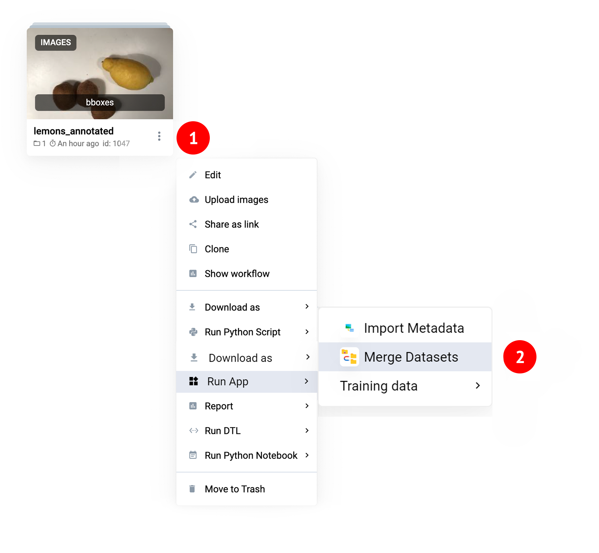
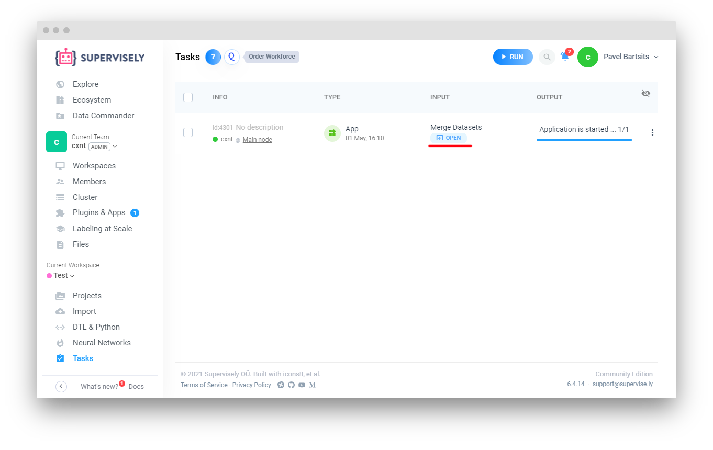
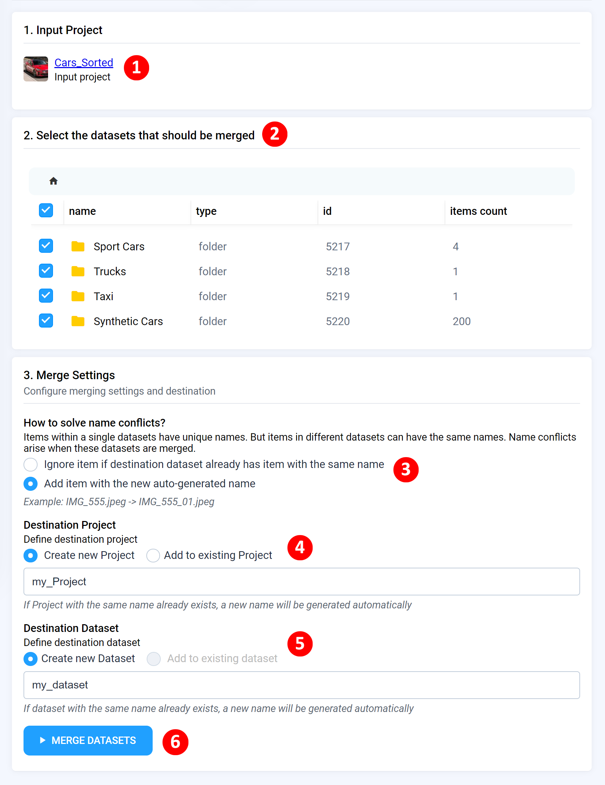
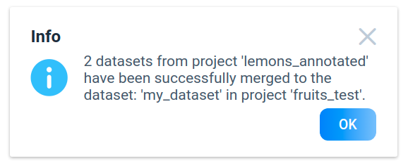
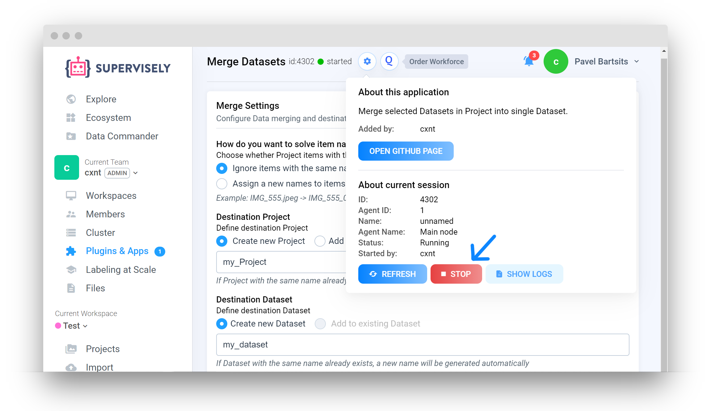
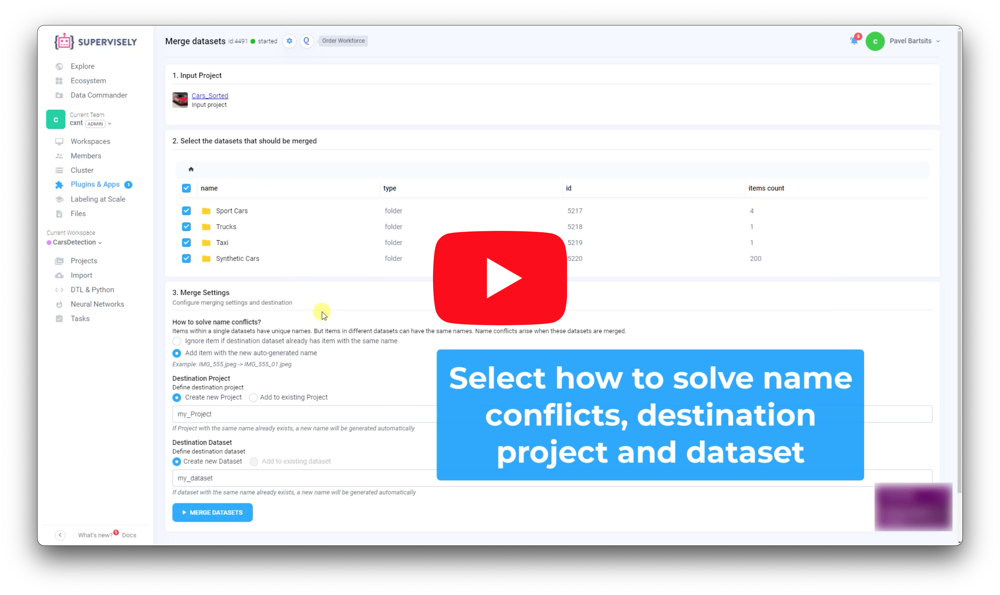

# Merge Datasets

  <a href="#Overview">Overview</a> •
  <a href="#How-To-Use">How To Use</a>

# Overview

Application allows to merge selected datasets in Project. Currently working only with `images` and `videos` project types.

# How To Run

**Step 1.** Add app to your team from [Ecosystem](https://ecosystem.supervise.ly/apps/merge-datasets) if it is not there.

**Step 2**: Open context menu of project -> `Run App` -> `Merge Datasets`

**Step 3**: Go to `Tasks` page and open application from there.

# How To Use

**Step 1.** Configure merging settings in UI 

**1.** Your source project

**2.** Select datasets from source project that should be merged

**3.** Choose how to resolve name conflicts

**4.** Select Destination Project

**5.** Select Destination Dataset

**6.** Press `Merge Datasets` button. Notification window appears when merging process has finished. 
   

**Step 2.** Stop application manually.

Watch short video for more details:

